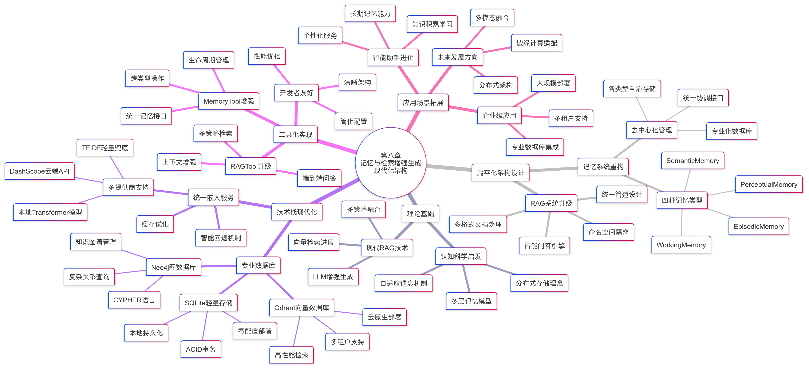

## RAG 系统
RAG: 检索-增强-生成
主要分为两个阶段: 数据准备阶段和应用检索阶段
**检索**：从向量数据库中检索知识
**增强**：将检索结果融入提示词，辅助模型生成
**生成**：生成具有准确性和透明度的答案
下面是 RAG 系统的完整工作流程:

将文档转换为markdown格式后:
标准Markdown文本 → 标题层次解析 → 段落语义分割 → Token计算分块 → 重叠策略优化 → 向量化准备

#### 一、高级检索策略
RAG系统的检索能力是核心竞争力。
在实际中，用户的查询表述与文档中的实际内容可能存在差异，导致文档无法被检索到。
HelloAgents 实现了三种互补的高级检索策：多查询扩展(MQE)、假设文档嵌入(HyDE)、统一的扩展检索框架

##### (1) 多查询扩展 (MQE)
MQE 通过生成语义等价的多样化查询来提高检索召回率的技术。优势在于能够自动理解用户查询的多种可能含义。

##### (2) 假设文档嵌入(HyDE)
HyDE 核心是通过答案去找答案，HyDE 先通过 LLM 生成一个假设性的答案，再用这个答案去检索真实文档。
优势在于假设文档的语义与真实文档的语义更相似

##### (3) 扩展检索框架
HelloAgents 将 MQE 和 HyDE 整合到统一的扩展检索框架中。
扩展检索的核心机制是 “扩展 - 检索 - 合并”
首先，系统根据原始查询生成多个扩展查询
然后，对每个扩展查询并行执行向量检索，获取候选文档池；
最后，通过去重和分数排序合并所有结果，返回最相关的top-k文档。

#### 实例1： 智能文档回答助手 
/home/kinuru/AI_Infra/Hello-Agent/hello-agents/agents/DocAssistant/base.py
+ 功能： 快速定位 pdf 文件中的关键信息，作为一个完整的交互式学习助手
+ 目标： 一个基于 Gradio 的 Web 应用，使用 RAGTool 和 MemoryTool构建
+ 步骤：pdf文档处理 -> RAG检索问答 -> 记忆系统 -> 集成助手 -> 收集所有统计信息，生成报告

#### 知识总结

