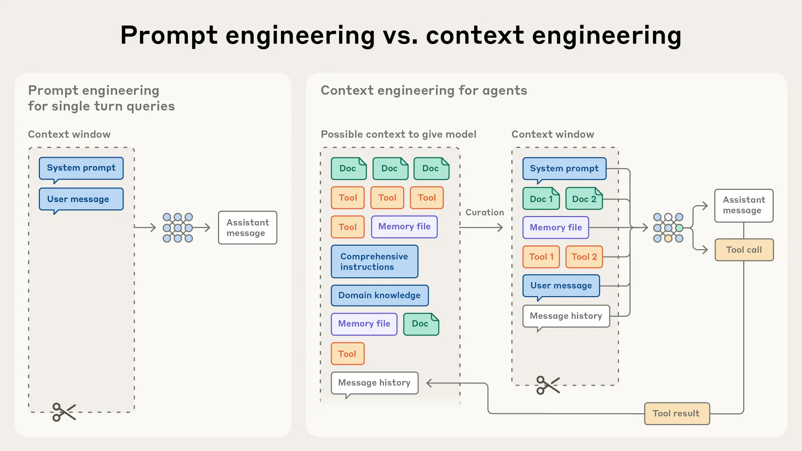

### 上下文工程

要让智能体在真实复杂场景中稳定地“思考”与“行动”,仅有记忆与检索还不够。
需要一套工程化的方法，持续、系统地为模型构造恰当的“上下文”。
上下文的目的是：**在每一次模型调用前, 如何以可复用、可度量、可演进的方式拼装并优化输入上下文**，从而提升正确性、鲁棒性和效率。

##### 主要内容：
- `ContextBuilder`: 上下文构建器，实现GSSC流水线，提供统一的上下文接口。
- `NoteTool`: 结构化笔记工具，支持智能体进行持久化记忆管理
- `TerminalTool`: 终端工具, 支持智能体进行文件系统操作和即时上下文检索。


“上下文”指对LLM进行采样时所包含的那组tokens, 问题是优化这些tokens的效用，以便稳定得到预期结果。



在工程化构建智能体时，他们在更长时间，长范围内跨多轮次的工作，需要能够管理整个上下文状态的策略。包括系统指令、工具、MCP、外部数据、消息历史等。

一个循环运行的智能体，会不断产生下轮推理可能相关的数据，这些信息必须被**周期性地提炼**。

#### 上下文工程的必要性：
随着模型的速度越快，可处理的数据规模越来越大，LLM和人类一样，会发生“上下文腐蚀”--随着上下文窗口的tokens增加，**模型从上下文中准确回忆信息的能力下降。**

为此，**上下文必须被视作一种有限资源，且具有边际收益递减。** 需要更谨慎地筛选哪些tokens应该被提供给 LLM

这种问题来源于LLM的架构约束, Transformer让每个token能够与上下文中的所有token建立关联，理论上形成 $n^2$ 的注意力关系。上下文长度增长会不可避免的带来这些问题。

在“有限注意力预算”的约束下，优秀的上下文工程目标是：**用尽可能少、但高信号密度的 tokens，最大化获得期望结果的概率。** 主要围绕以下组件展开：
  
- **系统提示**：语言清晰、直白，信息层级把握在“刚刚好”的高度
- **工具**：工具定义了智能体与信息/行动空间的契约，必须促进效率：既要返回token 友好的信息，又要鼓励高效的智能体行为。
- **示例**：精挑细选一组多样且典型的示例，直接画像“期望行为”。


对于Agent，可以看作在循环中自主调用工具的LLM。需要权衡的是，运行时探索往往比预计算检索更慢，并且需要有“主见”的工程设计来确保模型拥有正确的工具和启发式。

在不少场景中，**混合策略** 更有效：前置加载少量“高价值”上下文以保证速度，然后允许智能体按需继续自主探索。边界的选择取决于任务动态性与时效要求。

#### 长时程任务中的上下文工程

长时程任务要求智能体在超出上下文窗口长序列行动中，仍能保持连贯性、上下文一直和目标导向。
面向这些约束的工程手段主要有三种：**压缩整合**、**结构化笔记** 和 **子代理架构**

+ **压缩整合**：
    当对话接近上下文上限时，对其进行高保真总结，并用该摘要重启一个新的上下文窗口，以维持长程连贯性。
    + 作用: 模型压缩保留架构性决策，丢弃重复的工具输出和噪声。
+ **结构化笔记**：
    智能体以固定频率将关键信息写入上下文外的持久化存储。
    + 作用: 以极低的上下文开销维持持久的状态和依赖关系。
+ **子代理架构**：
    多个专长子代理在“干净的上下文窗口”中各自深挖、调用工具并探索，最后仅回传凝练摘要（常见 1,000–2,000 tokens）。
    + 作用: 让庞大的搜索上下文停留在子代理内部。主代理专注整合和推理。

总的来说：
+ 压缩整合：适合需要长对话连续性的任务，强调上下文的“接力”。
+ 结构化笔记：适合有里程碑/阶段性成果的迭代式开发与研究。
+ 子代理架构：适合复杂研究与分析，能从并行探索中获益。

**1.`ContextBuilder:`**
详细内容于/home/kinuru/AI_Infra/Hello-Agent/hello-agents/context/builder.py，实现GSSC流水线，将MemoryTool和RAGTool组合起来。

**2.`NoteTool`**
适合场景：长期项目追踪，结构化管理的项目式任务。`NoteTool`提供轻量级的状态追踪。
`NoteTool` 采用Markdown + YAML的混合格式。
```
# 记录任务状态
notes.run({
    "action": "create",
    "title": "重构项目 - 第一阶段",
    "content": "已完成数据模型层的重构,测试覆盖率达到85%。下一步将重构业务逻辑层。",
    "note_type": "task_state",
    "tags": ["refactoring", "phase1"]
})

# 记录阻塞点
notes.run({
    "action": "create",
    "title": "依赖冲突问题",
    "content": "发现某些第三方库版本不兼容,需要解决。影响范围:业务逻辑层的3个模块。",
    "note_type": "blocker",
    "tags": ["dependency", "urgent"]
})
```
主要有七个操作：
（1）create：创建笔记
（2）read：读取笔记
（3）update：更新笔记
（4）search：搜索笔记
（5）list：列出笔记
（6）summary：笔记摘要
（7）delete：删除笔记


