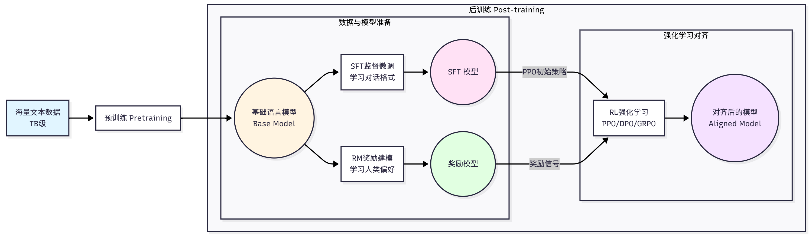

## Agentic-RL

在实现智能体范式和通信协议后，智能体在处理复杂任务时仍会表现不佳。
自然会有疑问：**如何让智能体具备更强的推理能力？如何让智能体更好地使用工具？**

为此提出为hello-agent 引入强化学习训练的能力。训练出具备推理、工具使用等高级能力的智能体。

对于如何将强化学习框架应用到智能体上，考虑这样一个数学问题：
```
Janet的鸭子每天下16个蛋。她每天早上早餐吃3个，每天还给朋友们烤松饼用掉4个。
她把剩下的蛋每天拿到农贸市场卖，每个新鲜鸭蛋2美元。
她每天在农贸市场赚多少美元？
```
这个问题需要多步推理:首先计算 Janet 每天剩余的鸡蛋数量(16 - 3 - 4 = 9)，然后计算她的收入(9 × 2 = 18)。

将任务映射到强化学习框架中：
+ **智能体**：基于LLM的推理系统
+ **环境**：数学问题和验证系统
+ **状态**：当前的问题描述
+ **行动**：生成下一步推理或最终答案
+ **奖励**：答案是否正确？

对于传统的监督学习存在三个局限：
+ 数据质量完全决定训练质量，模型只能模仿训练数据。
+ 缺乏探索能力，只能被动学习人类提供的路径。
+ 难以优化长期目标，无法精确优化多步推理的中间过程。

而强化学习则为其提供了多种新的可能性。让智能体自主生成多个答案根据正确性获得奖励。

--------
### LLM训练流程

首先要连接LLM训练的完整流程，强大的LLM一般有两个阶段：预训练和后训练。


##### 预训练阶段
目标是让模型学习语言的基本规律和世界知识。使用海量的文本数据，通过自监督的方式训练模型，例如根据一个文本序列 ${x_1, x_2 ... x_t}$，让模型来预测下一个词 ${x_{t+1}}$。
$$
L_{pretrain}=-\sum^{T}_{t=1}logP(x_t|x_1,x_2,...,x_{t-1};\theta)
$$
其中 $\theta$ 是模型参数，$P(x_t|x_1,x_2,...,x_{t-1};\theta)$则是模型预测的下一个词的概率分布。
预训练阶段特点是数据量巨大、计算成本高。训练过程通常采用从未标注文本中自动构造监督信号的自监督目标。


##### 后训练阶段
主要是解决预训练模型的不足，预训练后虽然具备了强大的语言能力，但只是一个预测模型，并不知道如何遵循人类的指令，生成有帮助的答案、拒绝不当的请求，以及如何和人交互。
后训练阶段旨在解决这些问题，让模型对齐人类的爱好和价值观。

后训练通常包括三个阶段：**监督微调(SFT), 奖励建模(RM), 强化学习微调**

第一步**监督微调**，目标是*让模型学会遵循指令和对话格式*。训练数据是(prompt, compeltion)对，训练目标与预训练类型。
$$
L_{SFT}=-\sum_{i=1}^{N}logP(y_i|x_i;\theta)
$$
其中, $x_i$ 是输入提示，$y_i$ 是期望的输出, N 是训练样本数量。SFT特点是数据量较小，需要人工标注，快速见效。

第二步是**奖励建模**。SFT后的模型虽然能遵循指令, 但生成的答案质量参差不齐。需要一个方式来评估回答的质量，这就是奖励模型的作用。
奖励模型的训练数据是偏好对比数据,包含同一个问题的两个回答,一个更好,一个更差。奖励模型的训练目标是学习人类的偏好。

$$
\mathcal{L}_{\mathrm{RM}}
=
-\mathbb{E}_{(x, y_w, y_l)}
\left[
\log \sigma\left(
r_\phi(x, y_w) - r_\phi(x, y_l)
\right)
\right]
$$
其中$r_{\phi}(x,y)$是奖励模型，$\sigma$ 是sigmoid函数，目标是让奖励模型给更好的回答更好的分数。

第三步是**强化学习微调**。有了奖励模型后, 我们就可以通过强化学习优化语言模型，生成更高质量的回答。最经典的算法是 PPO, 训练目标是:

$$
J_{\mathrm{PPO}}
=
\mathbb{E}_{x, y \sim \pi_\theta}
\left[r_\phi(x,y)\right]
-
\beta \cdot
D_{\mathrm{KL}}
\left(\pi_\theta \,\|\, \pi_{\mathrm{ref}}\right)
$$

其中 $\pi_{\theta}$是当前策略，即语言模型, $\pi_{ref}$是参考策略，可以是SFT模型。$r_{\phi}(x,y)$ 是奖励模型的评分。$D_{KL}$ 是KL散度，目的是防止模型偏离太远。
该目标函数的含义是: 最大化奖励，并且不会偏离原始模型太远。

--------
### Agentic RL与传统训练的区别

传统的后训练(PBRFT, Preference-Based Reinforcement Fine-Tuning)主要关注单轮对话的质量优化。但对于需要多轮推理、工具调用和长期规划的智能体任务来说，显得力不从心。

Agentic RL则是一种新的范式, 将LLM视为一种可学习的策略，嵌入在一个顺序决策循环中。智能体需要优化长期的累计奖励，而不是单步奖励。

Agentic RL的关键特征是多步交互、每一步的行动都会改变环境状态、每一步都会获得反馈、优化整个任务的完成质量。

强化学习常用马尔可夫决策过程(MDP)框架进行形式化。MDP由五元组(S, A, P, R, γ)定义: 状态空间S, 行动空间A, 状态转移函数P(s'|s, a), 奖励函数R(s,a)和折扣因子γ。


Agentic RL 的最终目的是赋予LLM智能体六大核心能力:


---------
### Agentic RL框架实现
我们选择TRL(Transformer Reinforcement Learning)框架, 模型选择Qwen3-0.6B, TRL是 Huggingface的强化学习库。Qwen3-0.6B是阿里云的小型语言模型。


自底向上一共有四层:
+ 数据集层：
`GSM8kDataset`类,`create_stf_dataset()`和`create_rl_dataset()`函数，负责加载和格式转换。
+ 奖励函数层：
包含`MathRewardFunction`类、`AccuracyReward`准确率奖励、`LengthPenaltyReward`长度惩罚、`StepReward`步骤奖励，以及便捷创建函数`create_*_reward()`，负责定义什么是好的行为。
+ 训练器层:
包括`SFTTranierWrapper`和`GRPOTrainerWrapper`，负责具体的训练逻辑和LoRA支持。
+ 统一接口层:
提供`RLTrainingTool`统一训练工具， 支持四种操作:`action="train"`，`action="load_dataset"`，`action="create_reward`，`action="evaluate"`。

-------
### 奖励函数的设计

奖励函数是强化学习的核心，能够决定训练是否成功。
在强化学习中，奖励函数$r(s,a)$或$r(s,a,s')$为智能体的每个行动分配一个数值奖励。智能体的目标就是最大化数值奖励:

$$
J(\theta)
=
\mathbb{E}_{\tau \sim \pi_\theta}
\left[
\sum_{t=0}^{T}
\gamma^t r(s_t, a_t)
\right]
$$

对于数学推理任务，可以简化为:

$$
r(q,a)=f(a,a^*)
$$

其中q是问题, a是模型生成的答案, a*是正确答案, f是评估函数。
为此，奖励函数的设计至关重要。坏的奖励函数可能只在任务结束时给奖励，多个目标矛盾，训练不收敛。

在Hello-Agents中设计三种内置奖励函数, 可以单独/组合使用：
+ 准确率奖励
+ 长度惩罚
+ 清晰推理步骤奖励


#### (1) 准确率奖励
准确率奖励只关心答案是否正确。
在实现时，要考虑最后处理答案和比较。模型的输出可能会包含大量的文本以及精度的差异。

准确率奖励的优点是简单直接，容易实现。缺点是奖励稀疏。

#### (2) 长度惩罚
长度惩罚鼓励模型生成简洁的回答，避免冗长啰嗦。数学定义为：

$$
r_{length}(a,a^*,l)=r_{acc}(a,a^*)-\alpha \cdot max(0,l-l_{target})
$$

只有在答案正确下才会应用长度惩罚，避免模型为了减少惩罚而生成错误的短答案。
缺点是可能一直详细推理, 需要调整惩罚系数, 不同任务的最优长度差异很大。


#### (3) 步骤奖励
步骤奖励鼓励模型生成清晰的推理步骤，提高可解释性。数学定义为:

$$
r_{step}(a,a^*,s) = r_{acc}(a,a^*)+\beta \cdot s
$$

同样, 只有在答案正确下才会给步骤奖励。
步骤检测方法包括: 查找"Step 1:"， "Step 2:"等标记、查找换行符数量、使用正则表达式匹配推理模式。
缺点是可能会生成更多冗余步骤，步骤检测可能不准确。

#### 小结
在实际中，我们通常会组合选择奖励函数，以达到不同的目标。


-----------
### 自定义数据集和奖励函数

SFT格式和RL格式有不同的数据要求:
SFT格式：
+ prompt：提示词
+ completion：期望的输出
+ text：完整的对话文本

RL格式：
+ question：问题
+ prompt：提示词
+ ground_truth：正确答案
+ full_answer：完整答案


#### （1）使用format_math_dataset转换

```
# 1. 准备原始数据
custom_data = [{"question": "What is 2+2?","answer": "2+2=4. #### 4"}]

# 2. 转换为Dataset对象
raw_dataset = Dataset.from_list(custom_data)

# 3. 转换为SFT格式
sft_dataset = format_math_dataset(
    dataset=raw_dataset,
    format_type="sft",
    model_name="Qwen/Qwen3-0.6B"
)

# 4. 转换为RL格式
rl_dataset = format_math_dataset(
    dataset=raw_dataset,
    format_type="rl",
    model_name="Qwen/Qwen3-0.6B"
)
```

#### （2）直接传入自定义数据集
```
from hello_agents.tools import RLTrainingTool
rl_tool = RLTrainingTool()

# SFT训练
result = rl_tool.run({
    "action": "train",
    "algorithm": "sft",
    "model_name": "Qwen/Qwen3-0.6B",
    "output_dir": "./models/custom_sft",
    "num_epochs": 3,
    "batch_size": 4,
    "use_lora": True,
    "custom_dataset": sft_dataset  # 直接传入自定义数据集
})

# GRPO训练
result = rl_tool.run({
    "action": "train",
    "algorithm": "grpo",
    "model_name": "Qwen/Qwen3-0.6B",
    "output_dir": "./models/custom_grpo",
    "num_epochs": 2,
    "batch_size": 2,
    "use_lora": True,
    "custom_dataset": rl_dataset  # 直接传入自定义数据集
})
```
#### （3）注册自定义数据集
```
rl_tool.register_dataset("my_math_dataset", rl_dataset)
result = rl_tool.run(
    "action": "train",
    "algorithm": "grpo",
    "dataset": "my_math_dataset",
    "output_dir": "./models/custom_grpo",
    "num_epochs": 2,
    "use_lora": True
)
```

对于自定义奖励函数，见`get_custom_reward.py`


--------

### SFT训练

监督微调（SFT，supervised Fine-Tuning）是强化学习训练的第一步, 也是最重要的基础。SFT让模型学习任务的基础格式。

#### 为什么需要SFT?
预训练模型虽然具备强大的预测下一个词的能力，但并没有解决数学问题/使用工具。其输出太过自由，我们需要一个结构化的输出。

SFT的作用是让模型学会输出格式，如何组织答案（例如：Step 1, Step 2 ...）。其次学习如何分解问题，逐步推导。(见`sft_solve_GSM8K.py`)

SFT很好的实现了结构化回答，统一格式。


#### LoRA 高效调参
对于刚才的模型Qwen3-0.6B，如果全量调参需要12/24GB的显存。直接全量微调对于大部分模型来说都不大可能。

为此有LoRA高效的微调方法，只训练少量的额外参数，保持原模型参数的冻结。
LoRA的核心思想是：模型微调时的参数变化可以用低秩矩阵表示。LoRA的优势是显存占用的大幅降低、训练速度更快。

#### SFT训练流程

完整的训练流程为：准备数据集 --> 配置LoRA --> 设置训练参数 --> 开始训练 --> 保存模型。

详细示例于`SFT_train.py`

在训练过程中，需要监视三个指标：损失函数，梯度方数，学习率。
需要注意如果模型训练时间过长，可以减少训练轮数，使用更小的模型。

#### 模型评估
评估指标有三个：准确率，平均奖励和推理质量。
+ 准确率： 答案完全正确的比例
+ 平均奖励：所有样本的平均奖励
+ 推理质量：推理过程中的清晰度和逻辑性，需要人工评估/专门的评估模型。

----------
### GRPO训练

在完成SFT训练后，我们能够生成结构化的答案。但是模型还只是“模仿”的过程，并没有“思考”。强化学习可以让模型通过试错来优化策略，超越训练数据的质量。

#### 从PPO到GRPO

PPO 作为最经典的算法之一, 能够限制策略更新的幅度，实现稳定的训练。但是，PPO 在LLM训练中需要维护四个模型：Policy Model, Reference Model, Value Model, Reward Model。

$$
L^{CLIP}(\theta)=E_t[min(r_tA_t, clip(r_t, 1-\epsilon, 1+\epsilon)A_t)]
$$
其中, $A_t = Q(s,a)-V(s)$. 代表着是否鼓励该动作.

对于GRPO的目标函数，其简化为：
$$
    J_{GRPO}(\theta)=E_{s,a\sim\pi_{theta}}[\frac{\pi_{\theta}(a|s)}{\pi_{ref}(a|s)}·(r(s,a)-\bar{r}_{group})]-\beta·D_{KL}(\pi_{\theta}||\pi_{ref})
$$
其中，$\bar{r}_{group}$表示组内平均奖励，$\beta$表示KL散度惩罚系数。
关键区别在于：GRPO采用了$r(s,a)-\bar{r}_{group}$代替A(s,a)。不需要Value Model。

二者训练流程和维度对比：


#### GRPO 训练过程解析

+ 采样阶段：对于每个问题，使用当前策略生成多个问题答案。
+ 奖励计算：对每个生成的答案计算奖励 $r_i$。
+ 相对奖励：计算平均奖励 $\bar{r}$ 和相对奖励 $\hat{r_i}=r_i-\bar{r}$。这样可以减少奖励方差。
+ 策略更新: 使用相对奖励更新策略，同时添加KL散度惩罚，防止策略偏离参考模型太远。
+ 重复上述策略。

【例子·1】
```
question = "What is 48 + 24?"

# 生成4个答案
answers = [
    "48 + 24 = 72. Final Answer: 72",      # 正确
    "48 + 24 = 72. Final Answer: 72",      # 正确
    "48 + 24 = 70. Final Answer: 70",      # 错误
    "Let me think... 72. Final Answer: 72" # 正确但冗长
]

# 计算奖励
rewards = [1.0, 1.0, 0.0, 0.8]

# 计算组内平均奖励和相对奖励
avg_reward = (1.0 + 1.0 + 0.0 + 0.8) / 4 = 0.7
relative_rewards = [
    1.0 - 0.7 = 0.3,   # 正确且简洁,相对奖励为正
    1.0 - 0.7 = 0.3,   # 正确且简洁,相对奖励为正
    0.0 - 0.7 = -0.7,  # 错误,相对奖励为负
    0.8 - 0.7 = 0.1    # 正确但冗长,相对奖励较小
]

# 策略更新：增加前两个答案的概率，减少第三个答案的概率。
```

在实际中，我们计算每个token的KL散度，然后求和。
若KL散度越大，则说明当前策略与参考模型差异越大。通过限制策略更新的幅度，避免遗忘SFT阶段的知识。
+ KL太小，策略可能会偏离太远
+ KL太大，策略的更新受限，学习缓慢

**训练监控：**
+ 平均奖励：应该逐渐上升。不上升的话，可能是lr太小，KL太大等；先升后降，可能是过拟合或者奖励崩塌。
+ KL散度：应该保持在合理范围内。
+ 准确率：应该逐步提高。
+ 生成质量：需要人工检查答案。

Weights & Biases 是目前最流行的机器学习实验跟踪平台，提供了强大的可视化和实验管理功能。
同时，TensorBoard 是 TensorFlow 提供的可视化工具，也支持 PyTorch 训练。

#### 模型评估和分析

评估体系一共有三类：准确性指标，效率指标，质量指标。
+ 准确性指标：准确率，top-k准确率，数值误差
+ 效率指标：平均长度，推理步骤数，推理时间数
+ 质量指标：格式正确，推理连贯性，可解释性。

同时，对于模型的错误，也可以分为4类：计算错误，推理错误，理解错误和格式错误。
SFT针对的主要是改正格式错误。

模型训练迭代的过程为：训练模型 -> 评估性能 -> 分析错误 -> 确定问题 -> 选择改进方向 -> 重新训练。


完整训练流程见: `End_to_End_train.py`

#### 超参数调优

对于提升模型的性能，下面是一些常用的调参策略

##### (1) 网格搜索

遍历所有的参数组合，选择最优的一组。

```
param_grid = {
    "learning_rate": [1e-5, 5e-5, 1e-4],
    "lora_rank": [8, 16, 32],
    "kl_coef": [0.05, 0.1, 0.2],   
}
best_accuracy = 0
best_params = None

# 遍历所有组合
for lr in param_grid["learning_rate"]:
    for rank in param_grid["lora_rank"]:
        for kl in param_grid["kl_coef"]:
        ....
```

##### (2) 随机搜索

通过随机采样参数组合, 比网格搜索更高效。
缺点是可能错过最优解。

##### (3) 贝叶斯优化

贝叶斯优化使用概率模型指导搜索, 更加智能。
缺点是需要复杂的库，适合计算资源有限的场景。

```
import optuna

def objective(trial):
    """优化目标函数"""
    lr = trial.suggest_loguniform("learning_rate", 1e-6, 1e-4)
    rank = trial.suggest_categorical("lora_rank", [8, 16, 32])
    kl = trial.suggest_uniform("kl_coef", 0.01, 0.5)

    result = rl_tool.run({
        "action": "train",
        "algorithm": "grpo",
        "learning_rate": lr,
        "lora_rank": rank,
        "kl_coef": kl,
        # 其他参数...
    })

    eval_result = rl_tool.run({
        "action": "evaluate",
        "model_path": result["model_path"],
    })

    return eval_result["accuracy"]

    study = optuna.create_study(direction="maximize")
    study.optimize(objective, n_trials = 20)
    print(f"最佳参数: {study.best_params}")
    print(f"最佳准确率: {study.best_value:.2%}")
```

#### 分布式训练

对于数据量增大的情况，单GPU训练速度缓慢。需要使用分布式训练来加速训练过程。
+ 单机多卡（2-8卡）：使用DDP，简单高效。
+ 大模型（>7B）：使用DeepSeed ZeRO-2/3
+ 多节点集群：DeepSeed ZeRO-3 + Offload

##### （1）配置Accelerate
首先需要创建 Accelerate 配置文件。运行以下命令: `accelerate config`
之后根据提示进行配置。

##### （2）使用DDP训练
数据并行（DDP）是最简单的分布式答案，每个GPU都有完整的副本。

##### （3）使用DeepSeed ZeRO训练

##### （4）多节点训练

##### （5）分布式训练实践
...

#### 生产部署
训练模型完成后，需要将模型部署到生产环境。一般有以下部署建议。

（1）模型导出：将LoRA权重合并到基础模型，方便部署。
（2）推理优化：使用量化技术和优化技术加速推理。
（3）API服务：使用FastAPI创建推理服务。
