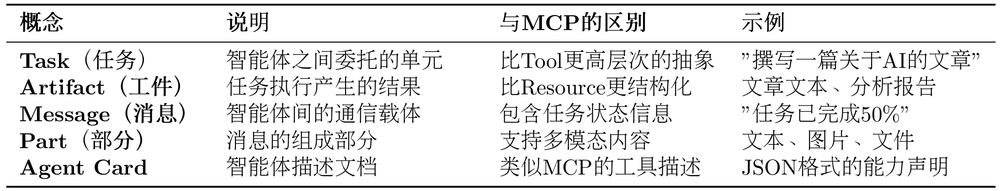

### A2A协议实战

MCP协议旨在解决智能体与工具之间的交互，而A2A协议则解决智能体之间的协作问题。
在一个需要多智能体协作的任务中，需要通信、委托任务、协商能力和同步状态。

传统星型拓扑的问题：
+ 单点故障 --> 整体瘫痪
+ 性能瓶颈 --> 所有通信都通过中心节点, 限制了并发
+ 扩展困难 --> 增加/修改智能体需要改动中心逻辑

A2A采用点对点架构, 允许智能体直接通信。同时，A2A工具还允许智能体之间进行磋商。

表1： A2A 核心概念

A2A为任务定义了标准化的声明周期，包括创建、协商、办理、执行中、失败等状态。

图1： A2A 生命周期

A2A 请求声明周期主要有四个步骤：**代理发现、身份验证、发送消息API和发送信息流API。**

图1： A2A 生命周期

