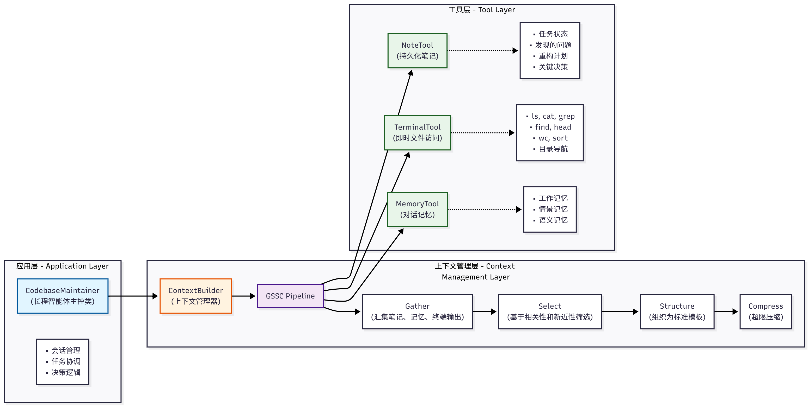

### 代码库维护助手

将ContextBuilder, Memory, NoteTool, TerminalTool整合起来，构建一个完整的智能体。
目的：
+ 探索和理解代码库结构
+ 记录发现的问题和改进点
+ 追踪长期的重构任务
+ 在上下文窗口限制下保持连贯

#### 1. 业务场景
假设正在维护一个中型的Python Web应用，这个代码库包含约 50 个 Python 文件，使用 Flask 框架构建，涵盖数据模型、业务逻辑、API 接口等多个模块，同时存在一些技术债务需要逐步清理。

使用该助手帮助探索代码库, 理解项目结构和依赖关系。解决代码中的问题并提供重构建议。

##### 问题：
1. 信息量超出上下文窗口，无法一次性放入上下文?--->> 使用TerminalTool进行即时、按需的代码探索。
2. 跨会话的状态管理，如何持续数天的对话? --->> 使用NoteTool记录阶段性进展和待办事项。
3. 上下文质量，如何避免无关信息淹没? --->> 使用ContextBuilder智能筛选和组织上下文,保证信息密度

##### Questions for test:
一、现在LLM 实际上不能调用 TerminalTool, 没有实际注册为可调用工具，仍是SimpleAgent的结构，没有ReAct的循环。

二、代码库信息被ContextBuilder丢弃,  metadata={"type": "code_structure"}。
而builder: 只会把以下类型放入证据：{"related_memory", "knowledge_base", "retrieval", "tool_result"}
code_structure 和 note 都不在其中，所以即使被选中，最终也不会进入 LLM 上下文。

三、收集到的信息太少，只有前20个Python文件的路径。

##### TODO List:
1. 将代码结构包类型改为 tool_result。
2. 让 note 类型真正进入 ContextBuilder 的 Context/Evidence。
3. 修复中文相关性计算，或者不要覆盖预设的相关性分数。
4. 在调用模型前主动采集 README、目录树、类/函数、Git 和测试信息。
5. 要求回答必须引用真实文件路径，缺少证据时不得下结论。
6. 不要自动把未经验证的模型回答保存为 blocker 笔记，否则错误会跨会话累积。
