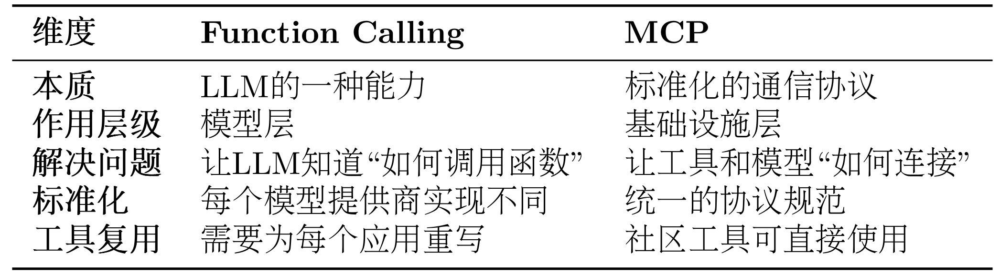

### MCP - Agent

假设智能体任务：
+ 读取本地文件系统的文档
+ 查询SQL数据库
+ 搜索Github代码
+ 发送Slack消息
+ 访问Google Drive

传统模型，需要为每个服务编写适配器代码，处理不同的 API、认证方式、错误处理等。同时，不同LLM平台的function call 实现差异巨大。

MCP 统一了智能体与外部工具的交互方式。无论使用的LLM是GPT还是claude，能够无缝访问相同的工具。

####  MCP 架构

MCP 协议采用Host、Client、Servers 三层架构设计。


####  MCP 工作流程

假设正在使用Claude Desktop询问:
1. Host(宿主层): Claude Desktop作为Host, 负责接收用户提问，并与Claude模型交互。Host是用户直接交互的界面。
2. Client(对话层): 当Claude模型需要访问文件系统时，Host中内置的MCP Client被激活，Client负责与适当的MCP Server建立连接，发送请求并接收响应。
3. Server(服务器层): 文件系统调用，执行实际的文件扫描操作，并返回找到的文件列表。

完整的流程：
+ 用户问题
+ Claude Desktop(Host)
+ Claude 模型分析
+ 需要访问文件系统
+ MCP Client连接
+ 文件系统 Server
+ 执行操作, 返回结果
+ Claude 生成答案
+ 显示在Claude Desktop上


#### 工具选择

当用户提出问题时, 完整的工具选择流如下:
1. 工作选择：MCP Client 连接到 Server 后，首先调用list_tools()获取所有可用工具的描述信息
2. 上下文构建：Client 将工具列表转换为 LLM 能理解的格式，添加到系统提示词中。例如：
```
你可以使用以下工具：
- read_file(path: str): 读取指定路径的文件内容
- search_code(query: str, language: str): 在代码库中搜索
```
3. 模型推理: LLM分析用户问题和可用工具, 决定是否需要调用工具以及调用哪个工具，决策基于工具的描述和对话上下文。
4. 工具执行: 如果LLM决定使用工具, Client 通过MCP Server执行所选工具.
5. 结果整合: 工具执行结果被送回给LLM, LLM结合结果生成给出最终答案。


##### MCP 与 function calling 差别:


Fuction Calling 与 MCP 并非竞争的关系，Fuction Calling理解何时需要调用函数，并生成相应的调用参数。而 MCP 则是基础设施协议的角色。

#### 传输方式：
MCP协议的一个重要特性是：**传输层无关性**，可以在不同的通信通道上运行。HelloAgents支持五种传输方式如下:


```
from hello_agents.tools import MCPTool

# 1. Memory Transport - 内存传输（用于测试）
# 不指定任何参数，使用内置演示服务器
mcp_tool = MCPTool()

# 2. Stdio Transport - 标准输入输出传输（本地开发）
# 使用命令列表启动本地服务器
mcp_tool = MCPTool(server_command=["python", "examples/mcp_example_server.py"])

# 3. Stdio Transport with Args - 带参数的命令传输
# 可以传递额外参数
mcp_tool = MCPTool(server_command=["python", "examples/mcp_example_server.py", "--debug"])

# 4. Stdio Transport - 社区服务器（npx方式）
# 使用npx启动社区MCP服务器
mcp_tool = MCPTool(server_command=["npx", "-y", "@modelcontextprotocol/server-filesystem", "."])

# 5. HTTP/SSE/StreamableHTTP Transport
# 注意：MCPTool主要用于Stdio和Memory传输
# 对于HTTP/SSE等远程传输，建议直接使用MCPClient
```

#### MCP生态
MCP协议的优势是丰富的社区生态，不需要从零开始编写工具适配器，可以直接使用这些经过验证的服务器。

##### MCP TODO:
+ 自动化网页测试（Playwright）
```
# Agent可以自动：
# - 打开浏览器访问网站
# - 填写表单并提交
# - 截图验证结果
# - 生成测试报告
playwright_tool = MCPTool(
    name="playwright",
    server_command=["npx", "-y", "@playwright/mcp"]
)
```
+ 项目管理自动化（Jira + GitHub）
```
# Agent可以：
# - 从GitHub Issue创建Jira任务
# - 同步代码提交到Jira
# - 自动更新Sprint进度
# - 生成项目报告
```
+ 内容创作工作流（YouTube + Notion + Spotify）
```
# Agent可以：
# - 获取YouTube视频字幕
# - 生成内容摘要
# - 保存到Notion数据库
# - 播放背景音乐（Spotify）
```


