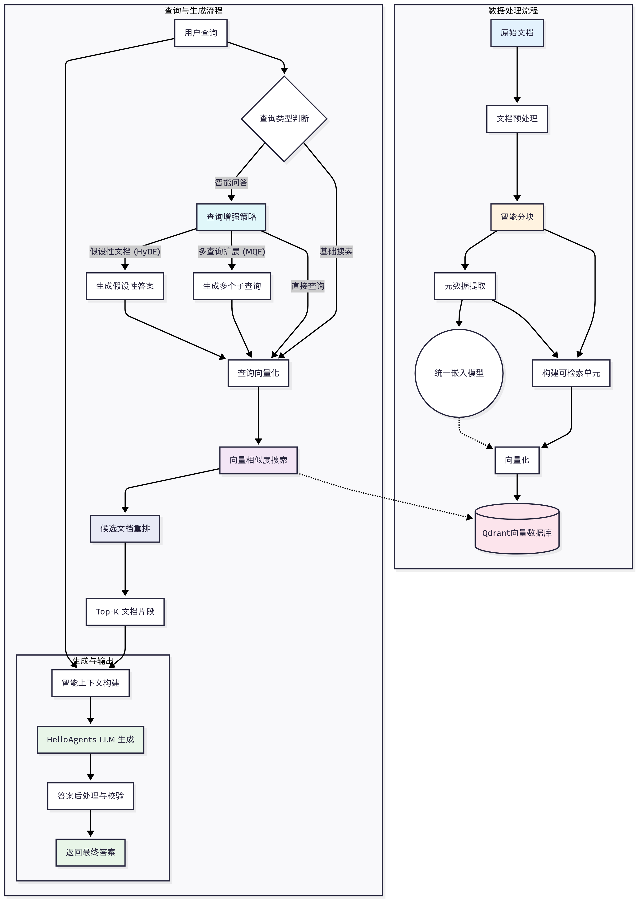

## RAG 系统
RAG: 检索-增强-生成
主要分为两个阶段: 数据准备阶段和应用检索阶段
**检索**：从向量数据库中检索知识
**增强**：将检索结果融入提示词，辅助模型生成
**生成**：生成具有准确性和透明度的答案
下面是 RAG 系统的完整工作流程:

将文档转换为markdown格式后:
标准Markdown文本 → 标题层次解析 → 段落语义分割 → Token计算分块 → 重叠策略优化 → 向量化准备
